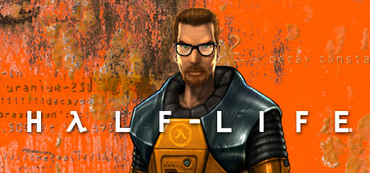

# THIS GAME DOES NOT EXIST

Checkout the live site here [thisgamedoesnotexist.jsonchin.com](https://thisgamedoesnotexist.jsonchin.com).

[Demo video on YouTube](https://www.youtube.com/watch?v=_mTWMLhpJoA)

# About

THIS GAME DOES NOT EXIST is an experiment in generative artificial intelligence. This site contains 130 video game pages that were generated using an implementation of OpenAI's Generative Pre-trained Transformer 2 (GPT-2) to generate text and a simple implementation of generative adversarial networks (GAN) to generate header images and "screenshots".

# Generating Text


*From Jay Alammar's The Illustrated GPT-2 (Visualizing Transformer Language Models)*

To generate the names, descriptions, publishers, and developers of the games I finetuned the HuggingFace implementation of GPT-2. I used the Steam Store Games (Clean dataset) from Kaggle with slight modifications and preprocessing.

Here is what one training sample looks like:

```<|game|><|name|>Half-Life<|developer|>Valve <|publisher|>Valve<|description|>Named Game of the Year by over 50 publications, Valve's debut title blends action and adventure with award-winning technology to create a frighteningly realistic world where players must think to survive. Also includes an exciting multiplayer mode that allows you to play against friends and enemies around the world.<|endoftext|>```

The model uses the tokens (e.g. <|game|> and <|description|>) to prompt each class of data while keeping context during the entire generation.

# Generating Images


*NVIDIA's celebrity face GAN from Progressive Growing of GANs for Improved Quality, Stability, and Variation*



*The header image of Valve's Half-Life*


*One of the headers that my model generated, looking to draw "text" in the header.*

Image generation was done by training a custom GAN very similar to the architecture seen in the PyTorch DCGAN Tutorial which was built to generate faces. I created two models for this site: one for generating the header images and one for generating multiple screenshots for each game.

To assemble the dataset I wrote a script that downloads the images from the URLs in the Steam Store Games (Clean dataset) dataset.

Due to my lack of resources and time to put into this project, the image generation is less than ideal. You may notice though, that the header image model will generate artifacts in images that look like the titles of games, and the screenshot image model with generate what looks like levels of a 2D platformer.
